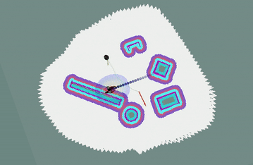
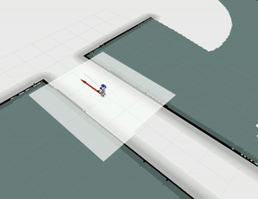

# NAO_Human_Aware_Navigation

This package has been developed for integrating [Human Aware Navigation](https://github.com/marinaKollmitz/human_aware_navigation) with NAO robot. All the required package are already put togther in the repository. 

This package has been developed to work with NAO v6 robot. But it could be easily adopted with other version by using the correct Python NAOqi SDK. Please install NAoqi SDK for NAO version 6 as it differs substantially from previous versions. 


## Human Aware Navigation 

Please launch the following files, as mentioned in [Human Aware Navigation](https://github.com/marinaKollmitz/human_aware_navigation).

```
$roslaunch human_aware_nav_launch sim_world.launch
$roslaunch human_aware_nav_launch navigation.launch
$rosrun people_detection fake_detection
```

 <p align="center">
  
 </p>

## Integration of NAO Robot with Human Aware Navigation 

"nao_han" under source folder contains all the code required for integration of NAO with HAN. Please set the following parameters in the files before launching them. 
```

  <env name="PYTHONPATH" value="$(env PYTHONPATH)" />

  <arg name="nao_ip"              default="130.251.13.122" />
  <arg name="nao_port"            default="$(optenv NAO_PORT 9559)" />

  <arg name="roscore_ip"          default="130.251.13.170" />
  <arg name="network_interface"   default="ens33" />

  <arg name="namespace"           default="nao_robot" />


```


```
$roslaunch nao_han nao_driver_only.launch
$roslaunch nao_han nao_navigation.launch
$roslaunch nao_han new_nao_walker.launch
```

 <p align="center">
  
 </p>
 
 ## Comments 
 - Disable the fire wall if new_nao_walker is unable to connect to NAO 
 - There will be few errors regarding nao_footprint and socket, if the robot is able to move by publishing to "/mobile_base/commands/velocity" topic then these error can be ignored. 
 
 - The command below can be executed in terminal to test the "new_nao_walker"
 ```
 rostopic pub /mobile_base/commands/velocity geometry_msgs/Twist "linear:
  x: 0.0
  y: 0.0
  z: 0.0
angular:
  x: 0.0
  y: 0.0
  z: 0.1"
  ```
  - Use nao_driver instead of bringup, as bringup launches few other scripts that might cause unexpected behaviour while using  "new_nao_walker.py" script. 
